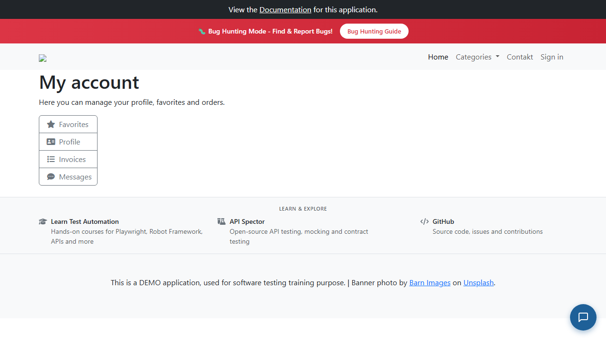

# BUG-003: Účet zákazníka se po opakovaných špatných pokusech o přihlášení nezablokuje

| | |
|---|---|
| **Stav** | Otevřená |
| **Nalezeno** | 28. 9. 2026 |
| **Oblast** | Přihlášení, bezpečnost |
| **Závažnost** | Kritická (návrh Vysoká, rozhodnutí vedoucího QA: Kritická) |
| **Automatizovaný test** | [`tests/auth/login.spec.ts`](../tests/auth/login.spec.ts) (TC-07), označený `test.fail()` |
| **Jira** | TQA-1 (zadání), bug viz odkaz v TQA-1 |

## Prostředí

- Aplikace: https://with-bugs.practicesoftwaretesting.com (titulek stránky „Practice Software Testing - Toolshop - v5.0 with bugs“)
- API: https://api-with-bugs.practicesoftwaretesting.com
- Prohlížeč: Chromium 153.0.8010.12 (Chrome for Testing z Playwright 1.63.0)
- OS: Windows 11

## Kroky k reprodukci

1. Zaregistruj nový testovací účet (např. přes `POST /users/register`).
2. Otevři https://with-bugs.practicesoftwaretesting.com/#/auth/login.
3. Zadej e-mail účtu a špatné heslo, klikni na **Login**. Zobrazí se „Invalid email or password“.
4. Krok 3 zopakuj celkem 3×.
5. Zadej e-mail účtu a **správné** heslo, klikni na **Login**.

## Očekávaný výsledek

Po 3 neúspěšných pokusech je účet zablokovaný. Ani správné heslo zákazníka nepustí dovnitř
a zobrazí se hláška o zablokování („Account locked, too many failed attempts. Please contact
the administrator.“, podle referenční verze aplikace). Limit 3 pokusů je upřesnění kritéria AC3 z TQA-1.

## Skutečný výsledek

Zákazník se přihlásí a otevře se stránka „My account“. Účet se nezablokuje vůbec:
přes API ověřeno 10 špatných pokusů (`POST /users/login` → 10× `401 {"error":"Unauthorized"}`)
a 11. pokus se správným heslem vrátil `200` s přístupovým tokenem.

## Důkaz

- Test: `tests/auth/login.spec.ts` TC-07, výstup před označením `test.fail()`:
  `Expected pattern: /locked/i`, na stránce po přihlášení nadpis „My account“ místo hlášky o zablokování.
- Screenshot (stránka účtu po 3 špatných pokusech a správném hesle):
  

## Dopad

- **Bezpečnost:** útočník může hesla zkoušet neomezeně (brute force, credential stuffing).
  Slabé heslo zákazníka jde uhodnout a útočník pak vidí jeho objednávky a osobní údaje.
- **Zadání:** akceptační kritérium AC3 v TQA-1 není splněné.

## Zdůvodnění závažnosti

Kritická (rozhodl vedoucí QA; tester navrhoval Vysokou): chybí základní ochrana přihlášení,
a tím i ochrana osobních údajů a objednávek zákazníků. TQA-1 výslovně uvádí, že přihlášení má
před kampaní prioritu. Běžné používání to neblokuje, proto původní návrh Vysoká.

## Návrh opravy

Počítat neúspěšné pokusy na účtu a po 3. pokusu přihlášení odmítat s hláškou o zablokování,
jak to dělá referenční verze (`MAX_LOGIN_ATTEMPTS = 3`).

## Co nebylo ověřeno

- Jestli se nezablokuje ani admin (ten má být podle referenční verze ze zablokování vyjmutý).
- Jestli existuje jiné omezení, např. podle IP adresy nebo počtu požadavků za minutu (rate limiting).
  10 rychlých pokusů za sebou omezeno nebylo.
- Není známo, jestli jde o záměrnou chybu verze „with bugs“.
