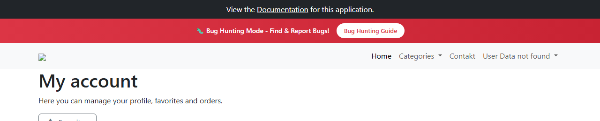

# BUG-004: Menu po přihlášení ukazuje „User Data not found“ místo jména zákazníka

| | |
|---|---|
| **Stav** | Otevřená |
| **Nalezeno** | 28. 9. 2026 |
| **Oblast** | Přihlášení, navigace |
| **Závažnost** | Střední (návrh, zdůvodnění níže) |
| **Automatizovaný test** | [`tests/auth/login.spec.ts`](../tests/auth/login.spec.ts) (TC-02), označený `test.fail()` |
| **Jira** | TQA-1 (zadání), bug viz odkaz v TQA-1 |

## Prostředí

- Aplikace: https://with-bugs.practicesoftwaretesting.com (titulek stránky „Practice Software Testing - Toolshop - v5.0 with bugs“)
- Prohlížeč: Chromium 153.0.8010.12 (Chrome for Testing z Playwright 1.63.0)
- OS: Windows 11

## Kroky k reprodukci

1. Otevři https://with-bugs.practicesoftwaretesting.com/#/auth/login.
2. Přihlas se platným zákaznickým účtem (ověřeno s nově registrovaným účtem „Tess Tester“
   i s demo účtem `customer2@practicesoftwaretesting.com` z dokumentace aplikace).
3. Podívej se na pravou stranu horního menu.

## Očekávaný výsledek

Uživatelské menu ukazuje jméno přihlášeného zákazníka (např. „Tess Tester“), aby zákazník
viděl, pod jakým účtem je přihlášený.

## Skutečný výsledek

Uživatelské menu (`data-test="nav-user-menu"`) ukazuje text „User Data not found“:

```html
<a href="#" role="button" id="user-menu" data-test="nav-user-menu" class="nav-link dropdown-toggle"> User Data not found </a>
```

Stránka „My account“ se přitom načte a menu (My account, Sign out, …) funguje.

## Důkaz

- Test: `tests/auth/login.spec.ts` TC-02, výstup před označením `test.fail()`:
  `Expected substring: "Tess Tester"`, `Received string: " User Data not found "`
- Screenshot: 

## Dopad

- **Každý přihlášený zákazník** vidí v hlavním menu chybovou hlášku. Nepozná, jestli je přihlášený
  pod svým účtem, a působí to, jako by se s jeho účtem něco pokazilo.
- Čtečka obrazovky tlačítko menu přečte jako „User Data not found“.

## Zdůvodnění závažnosti

Střední: chyba potká všechny přihlášené zákazníky na viditelném místě a snižuje důvěru,
přihlášení ani práci s účtem ale neblokuje.

## Návrh opravy

Neznámý, řeší vývoj. Průzkum ukázal, že hned po přihlášení vrátí `GET /users/me` odpověď `401`
a teprve později `200`. Menu možná zůstane u výsledku prvního volání.

## Co nebylo ověřeno

- Jestli se jméno objeví po obnovení stránky nebo po přechodu na jinou stránku.
- Admin účet.
- Není známo, jestli jde o záměrnou chybu verze „with bugs“.
