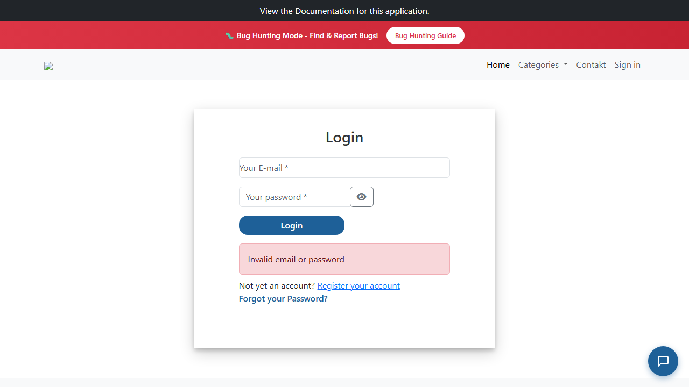

# BUG-005: Přihlašovací formulář nekontroluje prázdná pole ani formát e-mailu

| | |
|---|---|
| **Stav** | Otevřená |
| **Nalezeno** | 28. 9. 2026 |
| **Oblast** | Přihlášení, validace formuláře |
| **Závažnost** | Nízká (návrh, zdůvodnění níže) |
| **Automatizovaný test** | [`tests/auth/login.spec.ts`](../tests/auth/login.spec.ts) (TC-05), označený `test.fail()` |
| **Jira** | TQA-1 (zadání, chyba je mimo jeho akceptační kritéria), bug viz odkaz v TQA-1 |

## Prostředí

- Aplikace: https://with-bugs.practicesoftwaretesting.com (titulek stránky „Practice Software Testing - Toolshop - v5.0 with bugs“)
- Prohlížeč: Chromium 153.0.8010.12 (Chrome for Testing z Playwright 1.63.0)
- OS: Windows 11

## Kroky k reprodukci

1. Otevři https://with-bugs.practicesoftwaretesting.com/#/auth/login.
2. Pole nech prázdná a klikni na **Login**.
3. Zopakuj s e-mailem ve špatném formátu (`not-an-email`) a libovolným heslem.

## Očekávaný výsledek

Formulář se na server neodešle. U polí se zobrazí konkrétní chyby, např. „e-mail je povinný“
a „heslo je povinné“, resp. „špatný formát e-mailu“. Referenční verze aplikace k tomu má prvky
`data-test="email-error"` a `data-test="password-error"`.

## Skutečný výsledek

Formulář se odešle na server s prázdnými hodnotami (`POST /users/login`, tělo `{"email":"","password":""}`,
odpověď `401`) a zobrazí se obecná hláška „Invalid email or password“. U e-mailu `not-an-email`
je výsledek stejný. Chyby u jednotlivých polí se nezobrazí.

## Důkaz

- Test: `tests/auth/login.spec.ts` TC-05, výstup před označením `test.fail()`:
  `getByTestId('email-error')` → `element(s) not found`
- Screenshot (po odeslání prázdného formuláře): 

## Dopad

- Zákazník, který zapomněl pole vyplnit nebo se v e-mailu překlepl, dostane zavádějící hlášku
  „Invalid email or password“ a může si myslet, že má špatné heslo.
- Zbytečné požadavky na server.

## Zdůvodnění závažnosti

Nízká: zhoršený zážitek a zavádějící hláška, přihlášení s vyplněnými údaji ale funguje normálně.
Chyba je mimo akceptační kritéria TQA-1.

## Návrh opravy

Doplnit do formuláře kontrolu povinných polí a formátu e-mailu před odesláním,
jako má referenční verze (`email-error`, `password-error`).

## Co nebylo ověřeno

- Kontrola délky hesla.
- Jak formulář hlásí chyby čtečce obrazovky.
- Není známo, jestli jde o záměrnou chybu verze „with bugs“.
