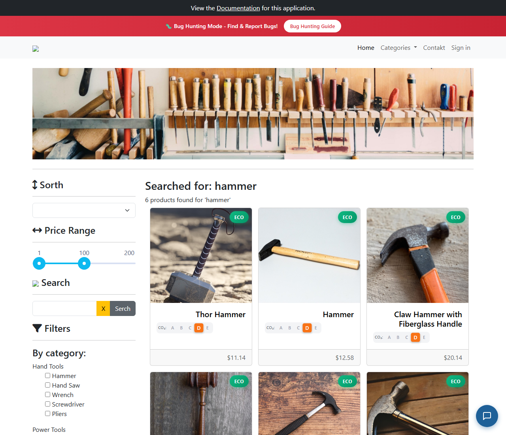

# BUG-006: Vyhledávání „hammer“ nenajde produkt Sledgehammer

| | |
|---|---|
| **Stav** | Otevřená |
| **Nalezeno** | 29. 9. 2026 |
| **Oblast** | Vyhledávání produktů (API `/products/search`) |
| **Závažnost** | Střední (návrh, zdůvodnění níže) |
| **Automatizovaný test** | [`tests/search/case-insensitive.spec.ts`](../tests/search/case-insensitive.spec.ts), označený `test.fail()` |

## Prostředí

- Aplikace: https://with-bugs.practicesoftwaretesting.com (titulek stránky „Practice Software Testing - Toolshop - v5.0 with bugs“)
- API: https://api-with-bugs.practicesoftwaretesting.com
- Prohlížeč: Chromium 153.0.8010.12 (Chrome for Testing z Playwright 1.63.0)
- OS: Windows 11

## Kroky k reprodukci

1. Otevři https://with-bugs.practicesoftwaretesting.com.
2. Do pole **Search** napiš `hammer` a klikni na tlačítko hledání.
3. Zopakuj s `Hammer` a `HAMMER`.
4. Pro srovnání vyhledej `ham` a `Sledgehammer`.

## Očekávaný výsledek

Vyhledávání vrátí všechny produkty, jejichž název hledaný výraz obsahuje (bez ohledu na velikost
písmen). Pro `hammer` je to 7 produktů: Claw Hammer, Claw Hammer with Fiberglass Handle,
Claw Hammer with Shock Reduction Grip, Court Hammer, Hammer, **Sledgehammer**, Thor Hammer.
Delší výraz nesmí najít produkt, který kratší výraz obsažený v něm nenajde.

## Skutečný výsledek

`hammer`, `Hammer` i `HAMMER` vrátí **6 produktů**, Sledgehammer mezi nimi chybí
(„6 products found for 'hammer'“). Kratší `ham` vrátí 7 produktů včetně Sledgehammeru
a `Sledgehammer` vrátí 1 produkt, takže produkt v katalogu je.

Chyba je v backendu, frontend jen zobrazí odpověď API:

| Požadavek | `total` | Sledgehammer |
|---|---|---|
| `GET /products/search?q=hammer` | 6 | ne |
| `GET /products/search?q=Hammer` | 6 | ne |
| `GET /products/search?q=ham` | 7 | ano |
| `GET /products/search?q=hamm` | 6 | ne |
| `GET /products/search?q=hamme` | 6 | ne |
| `GET /products/search?q=sledge` | 1 | ano |
| `GET /products/search?q=Sledgehammer` | 1 | ano |

Hranice je mezi 3 a 4 znaky: `ham` Sledgehammer najde, `hamm` už ne. Začátek názvu (`sledge`)
funguje.

## Důkaz

- Test: `tests/search/case-insensitive.spec.ts`, výstup před označením `test.fail()`
  (3 běhy ze 3 stejně):
  ```
  expect(received).toEqual(expected) // deep equality
  - Expected  - 1
  + Received  + 0
  -   "Sledgehammer",
  ```
  S dočasně chybným očekáváním (seznam bez Sledgehammeru) test projde, selhává tedy jen kvůli této chybě.
- Screenshot (výsledek hledání `hammer`): 

## Dopad

- Zákazník, který hledá kladivo slovem „hammer“, perlík (Sledgehammer) vůbec neuvidí
  a může odejít s tím, že ho obchod nemá.
- Výsledky jsou nekonzistentní: kratší výraz najde víc než delší, což mate uživatele i testy.

## Zdůvodnění závažnosti

Střední: vyhledávání funguje, ale neúplně. Chyba zasáhne každého, kdo hledá výraz, který je
uprostřed názvu produktu. Úkol uživatele neblokuje úplně (produkt jde najít kratším výrazem
nebo v kategorii), ale uživatel to nemá jak poznat a o prodej se může přijít.

## Návrh opravy

Neznámý, řeší vývoj. Chování naznačuje, že backend pro výrazy od 4 znaků nehledá podřetězec
kdekoli v názvu, ale jinou strategií (např. jen od začátku slova).

## Co nebylo ověřeno

- Jestli se chyba týká i jiných slov uprostřed názvu (např. části jiných složených názvů).
- Jiné prohlížeče než Chromium (chyba je v API, prohlížeč by vliv mít neměl).
- Není známo, jestli jde o záměrnou chybu verze „with bugs“.
