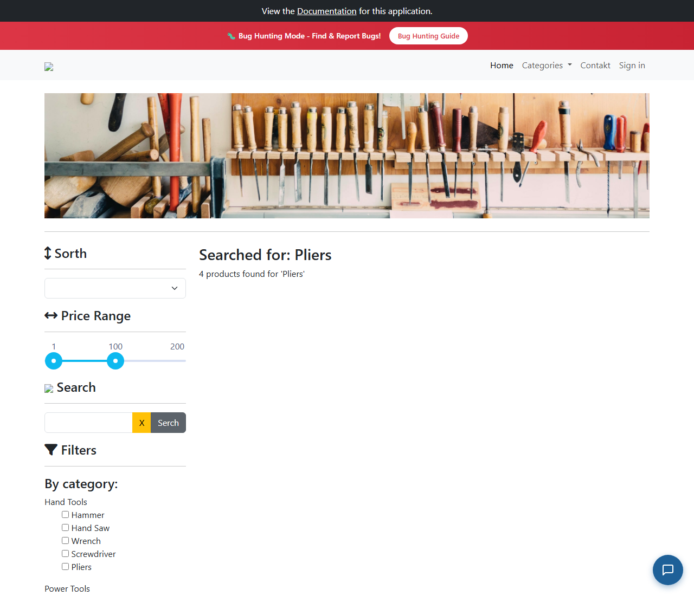

# BUG-007: Hledání z druhé stránky výpisu nezobrazí žádný produkt

| | |
|---|---|
| **Stav** | Otevřená |
| **Nalezeno** | 29. 9. 2026 |
| **Oblast** | Vyhledávání produktů, stránkování |
| **Závažnost** | Vysoká (návrh, zdůvodnění níže) |
| **Automatizovaný test** | [`tests/search/from-page-2.spec.ts`](../tests/search/from-page-2.spec.ts), označený `test.fail()` |
| **Jira** | TQA-7 |

## Prostředí

- Aplikace: https://with-bugs.practicesoftwaretesting.com (titulek stránky „Practice Software Testing - Toolshop - v5.0 with bugs“)
- Prohlížeč: Chromium 153.0.8010.12 (Chrome for Testing z Playwright 1.63.0)
- OS: Windows 11

## Kroky k reprodukci

1. Otevři https://with-bugs.practicesoftwaretesting.com.
2. Ve stránkování pod produkty klikni na **2**.
3. Do pole **Search** napiš `Pliers` a klikni na tlačítko hledání.

## Očekávaný výsledek

Zobrazí se 4 nalezené produkty (Combination Pliers, Long Nose Pliers, Pliers, Slip Joint Pliers),
výsledky začínají od první stránky.

## Skutečný výsledek

Stránka ukáže „Searched for: Pliers“ a „4 products found for 'Pliers'“, ale **žádnou kartu produktu**
a prázdné stránkování. Nezmění se to ani po 10 sekundách.

API přitom vrací správná data: prohlížeč pošle `GET /products/search?q=Pliers` (bez čísla stránky)
a odpověď obsahuje všechny 4 produkty. Chyba je tedy ve frontendu, který je nevykreslí.
Stejné hledání z první stránky funguje (test `tests/search/partial-name.spec.ts`).

## Důkaz

- Test: `tests/search/from-page-2.spec.ts`, výstup před označením `test.fail()`:
  ```
  - Expected  - 6
  + Received  + 1
  -   "Combination Pliers", "Long Nose Pliers", "Pliers", "Slip Joint Pliers"
  + Array []
  ```
  S dočasně chybným očekáváním (prázdný seznam) test projde, selhává tedy jen kvůli této chybě.
- Screenshot: 

## Dopad

- Každý zákazník, který si prošel výpis na další stránku a pak hledá, uvidí „4 products found“,
  ale nic. Hledání pro něj nefunguje a nabídka působí rozbitě.

## Zdůvodnění závažnosti

Vysoká: hlavní funkce (vyhledávání) po běžném postupu nefunguje. Dá se obejít (vrátit se na
stránku 1 nebo znovu načíst stránku), ale zákazník to nemá jak poznat.

## Návrh opravy

Neznámý, řeší vývoj. Frontend si pravděpodobně pamatuje číslo stránky z výpisu a z výsledků
hledání (jen 1 stránka) zobrazuje stránku 2, která je prázdná. Při novém hledání vrátit stránkování na 1.

## Co nebylo ověřeno

- Hledání ze stránky 3 a s výrazem, který má víc než 1 stránku výsledků.
- Jestli se totéž děje po filtru kategorie nebo značky.
