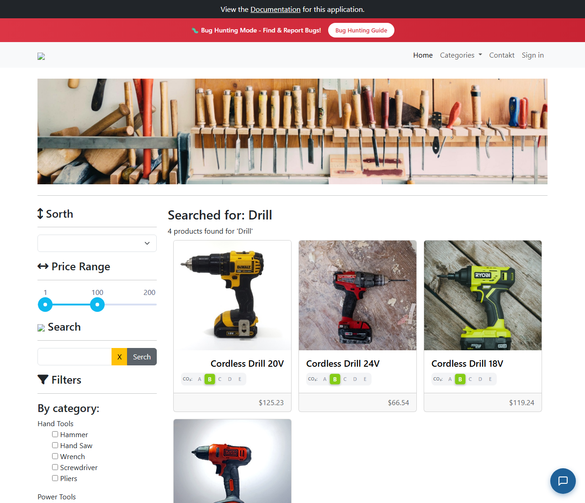

# BUG-008: Vyhledávací pole se po odeslání vymaže

| | |
|---|---|
| **Stav** | Otevřená |
| **Nalezeno** | 29. 9. 2026 |
| **Oblast** | Vyhledávání produktů |
| **Závažnost** | Nízká (návrh, zdůvodnění níže) |
| **Automatizovaný test** | [`tests/search/input-state.spec.ts`](../tests/search/input-state.spec.ts), označený `test.fail()` |
| **Jira** | TQA-8 |

## Prostředí

- Aplikace: https://with-bugs.practicesoftwaretesting.com (titulek stránky „Practice Software Testing - Toolshop - v5.0 with bugs“)
- Prohlížeč: Chromium 153.0.8010.12 (Chrome for Testing z Playwright 1.63.0)
- OS: Windows 11

## Kroky k reprodukci

1. Otevři https://with-bugs.practicesoftwaretesting.com.
2. Do pole **Search** napiš `Drill` a klikni na tlačítko hledání.
3. Počkej na výsledky („4 products found for 'Drill'“) a podívej se do pole Search.

## Očekávaný výsledek

V poli zůstane hledaný výraz `Drill`, aby ho zákazník mohl upravit (běžné chování vyhledávání).

## Skutečný výsledek

Pole je prázdné. Totéž platí pro další výrazy, které projdou validací (ověřeno `Saw`, `młotek`,
`Saw%`, `a_b`, `ab-c`, 40× `a` tlačítkem; `Saw` i klávesou Enter). Výraz, který validací neprojde
(`%`), v poli zůstane, protože se formulář vůbec neodešle.

## Důkaz

- Test: `tests/search/input-state.spec.ts`, výstup před označením `test.fail()`:
  `Expected: "Drill"`, `Received: ""`.
  S dočasně chybným očekáváním (`''`) test projde.
- Screenshot: 

## Dopad

- Zákazník, který chce hledání upřesnit (např. z „Drill“ na „Drill 18V“), musí výraz psát znovu.
- Na stránce výsledků není v poli vidět, co se hledalo (jen v nadpisu).

## Zdůvodnění závažnosti

Nízká: zhoršený zážitek, vyhledávání funguje. Úkol uživatele neblokuje.

## Návrh opravy

Po odeslání formuláře pole nemazat (nevolat reset formuláře), nebo ho znovu naplnit hledaným výrazem.

## Co nebylo ověřeno

- Chování po návratu tlačítkem Zpět v prohlížeči.
