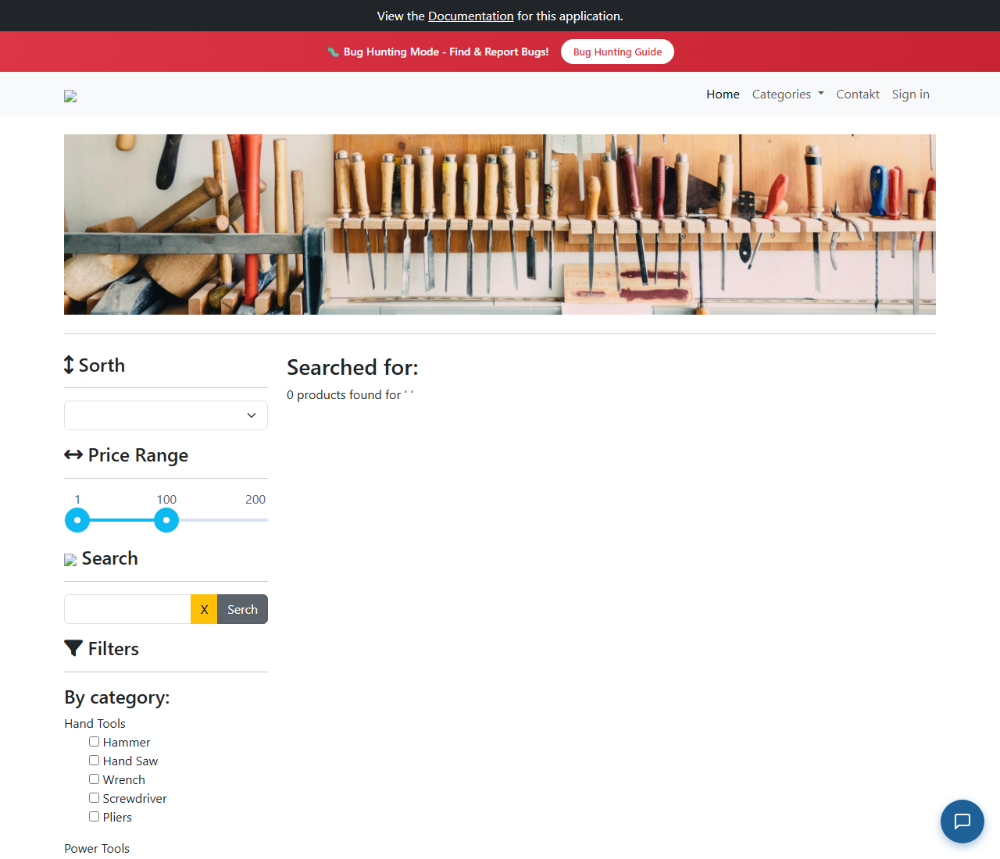

# BUG-009: Hledání samých mezer projde validací a ukáže „0 products found“

| | |
|---|---|
| **Stav** | Otevřená |
| **Nalezeno** | 29. 9. 2026 |
| **Oblast** | Vyhledávání produktů, validace formuláře |
| **Závažnost** | Nízká (návrh, zdůvodnění níže) |
| **Automatizovaný test** | [`tests/search/whitespace.spec.ts`](../tests/search/whitespace.spec.ts), označený `test.fail()` |
| **Jira** | TQA-9 (souvisí s dotazem TQA-12) |

## Prostředí

- Aplikace: https://with-bugs.practicesoftwaretesting.com (titulek stránky „Practice Software Testing - Toolshop - v5.0 with bugs“)
- Prohlížeč: Chromium 153.0.8010.12 (Chrome for Testing z Playwright 1.63.0)
- OS: Windows 11

## Kroky k reprodukci

1. Otevři https://with-bugs.practicesoftwaretesting.com.
2. Do pole **Search** napiš tři mezery a klikni na tlačítko hledání.

## Očekávaný výsledek

Výraz ze samých mezer se bere jako prázdné hledání: zůstane celý výpis produktů,
bez nadpisu „Searched for“ a bez „0 products found“.

## Skutečný výsledek

Zobrazí se „Searched for:“ (bez výrazu) a „0 products found for '   '“, výpis produktů zmizí.

Příčina: pole má validaci délky 3–40 znaků a do délky počítá i mezery. Tři mezery jsou pro
validaci platný výraz (`ng-valid`), kdežto `ab` nebo ` a` platné nejsou. Výraz se před
hledáním neořízne.

## Důkaz

- Test: `tests/search/whitespace.spec.ts` (krok 1), výstup před označením `test.fail()`:
  `getByTestId('search-result-count')` → `Expected: 0`, `Received: 1`.
  S dočasně chybným očekáváním („0 products found“, žádný produkt) test projde celý, včetně kroku 2.
- Screenshot: 

## Dopad

- Zákazník, který omylem odešle mezery, ztratí výpis produktů a vidí matoucí „0 products found“.

## Zdůvodnění závažnosti

Nízká: okrajový vstup, zhoršený zážitek. Úkol uživatele neblokuje, výpis vrátí tlačítko X.

## Návrh opravy

Výraz před validací a hledáním oříznout (trim), výraz ze samých mezer brát jako prázdný.

## Co nebylo ověřeno

- Výraz s mezerami uvnitř a kratším textem (např. `a  `), který by po oříznutí neměl projít validací.
