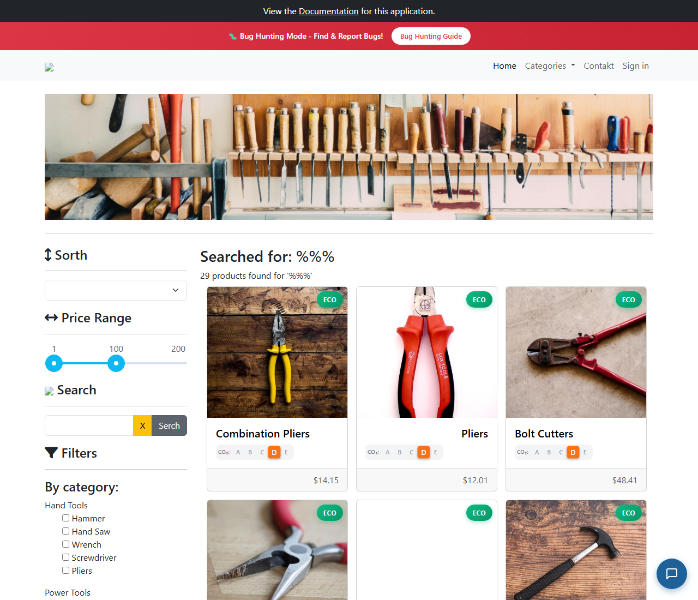

# BUG-010: Znaky `%` a `_` ve vyhledávání fungují jako zástupné znaky SQL

| | |
|---|---|
| **Stav** | Otevřená |
| **Nalezeno** | 29. 9. 2026 |
| **Oblast** | Vyhledávání produktů (API `/products/search`) |
| **Závažnost** | Nízká (návrh, zdůvodnění níže) |
| **Automatizovaný test** | [`tests/search/special-characters.spec.ts`](../tests/search/special-characters.spec.ts) (testy `'%%%'` a `'___'`), označené `test.fail()` |
| **Jira** | TQA-10 |

## Prostředí

- Aplikace: https://with-bugs.practicesoftwaretesting.com (titulek stránky „Practice Software Testing - Toolshop - v5.0 with bugs“)
- API: https://api-with-bugs.practicesoftwaretesting.com
- Prohlížeč: Chromium 153.0.8010.12 (Chrome for Testing z Playwright 1.63.0)
- OS: Windows 11

## Kroky k reprodukci

1. Otevři https://with-bugs.practicesoftwaretesting.com.
2. Do pole **Search** napiš `%%%` a klikni na tlačítko hledání.
3. Zopakuj s `___` (tři podtržítka).

## Očekávaný výsledek

Znaky se hledají doslova. Žádný produkt nemá v názvu `%%%` ani `___`, takže
„0 products found“.

## Skutečný výsledek

Obě hledání vrátí **celý katalog: „29 products found“**. Chyba je v API:

| Požadavek | `total` |
|---|---|
| `GET /products/search?q=%%%` | 29 |
| `GET /products/search?q=___` | 29 |
| `GET /products/search?q=S_w` | 2 (Wood Saw, Circular Saw) |

`%` se chová jako „cokoli“ a `_` jako „jeden libovolný znak“, tedy jako zástupné znaky
v SQL `LIKE`. Hledaný výraz se před vložením do dotazu neošetří.

Pozn.: jeden `%` nebo `_` do API vůbec nedojde, formulář odmítne výrazy kratší než 3 znaky
(viz BUG-011).

## Důkaz

- Test: `tests/search/special-characters.spec.ts`, výstup před označením `test.fail()`:
  `Expected: "0 products found for '%%%'"`, `Received: " 29 products found for '%%%' "` (stejně pro `___`).
  S dočasně chybným očekáváním („29 products found“) oba testy projdou.
- Screenshot: 

## Dopad

- Hledání výrazu se `%` nebo `_` (např. rozměr „50%“, kód „M_10“) vrátí nečekané výsledky.
- Neošetřený vstup v SQL dotazu je signál pro bezpečnostní kontrolu. Samotné zástupné znaky
  SQL injection nejsou, ale stojí za ověření, jak se vstup do dotazu skládá.

## Zdůvodnění závažnosti

Nízká: zákazníci tyto znaky hledají zřídka a úkol to neblokuje. Bezpečnostní aspekt by měl
posoudit vývoj; pokud by se ukázalo, že vstup není parametrizovaný, závažnost výrazně roste.

## Návrh opravy

V API escapovat `%`, `_` (a `\`) v hledaném výrazu před použitím v `LIKE`, dotaz parametrizovat.

## Co nebylo ověřeno

- Jestli je dotaz parametrizovaný (SQL injection se netestovala, mimo rozsah).
- Jiné endpointy s hledáním nebo filtrem.
