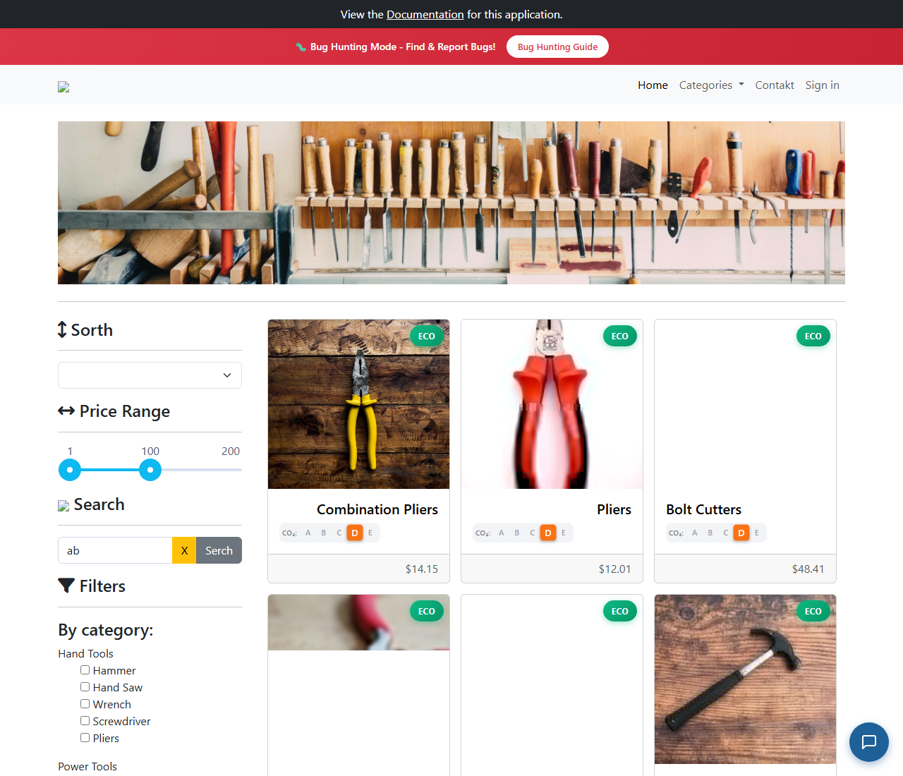

# BUG-011: Vyhledávání odmítne krátký nebo dlouhý výraz bez jakékoli hlášky

| | |
|---|---|
| **Stav** | Otevřená |
| **Nalezeno** | 29. 9. 2026 |
| **Oblast** | Přístupnost (a11y), vyhledávání produktů |
| **Závažnost** | Střední (návrh, zdůvodnění níže) |
| **Automatizovaný test** | [`tests/accessibility/search-validation.spec.ts`](../tests/accessibility/search-validation.spec.ts), označený `test.fail()` |
| **Jira** | TQA-11 |

## Prostředí

- Aplikace: https://with-bugs.practicesoftwaretesting.com (titulek stránky „Practice Software Testing - Toolshop - v5.0 with bugs“)
- Prohlížeč: Chromium 153.0.8010.12 (Chrome for Testing z Playwright 1.63.0)
- OS: Windows 11

## Kroky k reprodukci

1. Otevři https://with-bugs.practicesoftwaretesting.com.
2. Do pole **Search** napiš `ab` a klikni na tlačítko hledání.
3. Zopakuj s výrazem delším než 40 znaků.

## Očekávaný výsledek

Aplikace řekne, proč hledání neproběhlo, např. „Zadejte 3 až 40 znaků“. Podle
[WCAG 2.2, kritérium 3.3.1 Identifikace chyby](https://www.w3.org/WAI/WCAG22/Understanding/error-identification.html)
(úroveň A): když aplikace chybu ve vstupu sama odhalí, označí pole a popíše chybu textem.
Pro čtečky obrazovky má pole `aria-invalid="true"` a text chyby je s polem propojený
(např. `aria-describedby`).

## Skutečný výsledek

Nestane se nic: žádný požadavek na server, žádná hláška, výsledky zůstanou beze změny.
Pole má jen interní třídu `ng-invalid` (Angular), nemá `aria-invalid` ani přístupný popis.

Zjištěná pravidla validace: platný výraz má 3–40 znaků (40 projde, 41 ne; `ab`, `%`, `1` ne).

## Důkaz

- Test: `tests/accessibility/search-validation.spec.ts`, výstup před označením `test.fail()`:
  `toHaveAttribute('aria-invalid', 'true')` → `Received: ""` (atribut chybí), pro 2 i 41 znaků.
  S dočasně chybným očekáváním (pole je `ng-invalid`, bez `aria-invalid` a bez popisu) test projde.
- Screenshot: 

## Dopad

- Zákazník si myslí, že tlačítko hledání nefunguje, nebo že aplikace „zamrzla“.
- Uživatel čtečky obrazovky nedostane žádnou zpětnou vazbu.
- Hledání krátkých výrazů (např. „3D“, „V8“) je nemožné a uživatel neví proč.

## Zdůvodnění závažnosti

Střední: porušení WCAG 2.2 úrovně A a matoucí chování, podobně jako BUG-001.
Hledání delších výrazů funguje, takže úkol to neblokuje úplně.

## Návrh opravy

Pod polem zobrazit text chyby, propojit ho s polem přes `aria-describedby`
a nastavit `aria-invalid="true"`. Zvážit i snížení minimální délky.

## Co nebylo ověřeno

- Jak chování ohlásí skutečná čtečka obrazovky (NVDA, VoiceOver).
- Jestli je minimální délka 3 znaky záměr (otázka pro zadání).
