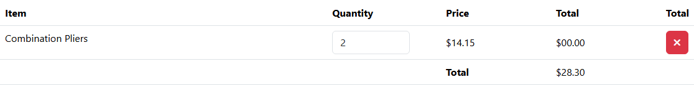

# BUG-014: Mezisoučet položky v košíku je vždy $00.00

| | |
|---|---|
| **Stav** | Otevřená |
| **Nalezeno** | 3. 10. 2026 |
| **Oblast** | Košík |
| **Závažnost** | Střední (návrh, zdůvodnění níže) |
| **Automatizovaný test** | [`tests/cart/cart.spec.ts`](../tests/cart/cart.spec.ts) (TC-03), označený `test.fail()` |
| **Jira** | TQA-15 (blokuje TQA-5, AC2) |

## Prostředí

- Aplikace: https://with-bugs.practicesoftwaretesting.com (titulek stránky „Practice Software Testing - Toolshop - v5.0 with bugs“),
  totéž na lokální kopii `sprint5-with-bugs`
- Prohlížeč: Chromium 153.0.8010.12 (Chrome for Testing z Playwright 1.63.0)
- OS: Windows 11

## Kroky k reprodukci

1. Otevři detail produktu https://with-bugs.practicesoftwaretesting.com/#/product/1 (Combination Pliers, $14.15).
2. Nastav množství 2 a klikni na **Add to cart**.
3. Otevři košík (ikona košíku v hlavičce).

## Očekávaný výsledek

Sloupec **Total** u položky ukazuje mezisoučet množství × cena: 2 × $14.15 = **$28.30**
(AC2 v TQA-5; referenční verze bez chyb počítá `quantity * price`).

## Skutečný výsledek

Mezisoučet položky (`data-test="line-price"`) je **$00.00**, pro jakékoli množství i produkt.
Celková cena košíku (`cart-total`) je přitom správně $28.30.

## Důkaz

- Test: `tests/cart/cart.spec.ts` TC-03, výstup před označením `test.fail()`:
  `Expected: "$28.30"`, `Received: "$00.00"`.
  S dočasně chybným očekáváním (`$00.00`) test projde.
- Screenshot: 

## Dopad

- Zákazník nevidí, kolik zaplatí za jednotlivé položky, a součet řádků neodpovídá celkové ceně.
  Působí to jako chyba v ceně a může vést k opuštění košíku (kontext TQA-5).

## Zdůvodnění závažnosti

Střední: chybný údaj o ceně, který zasáhne každého zákazníka s košíkem. Celková cena je správně,
takže zákazník nezaplatí špatnou částku a nákup to neblokuje.

## Návrh opravy

Zobrazit `množství × cena` (jako referenční verze).

## Co nebylo ověřeno

- Produkty se slevou (`discounted_price`) a půjčovna (`is_rental`).
