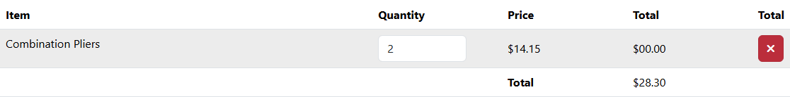

# BUG-015: Tlačítko pro odebrání položky z košíku nic neudělá

| | |
|---|---|
| **Stav** | Otevřená |
| **Nalezeno** | 3. 10. 2026 |
| **Oblast** | Košík |
| **Závažnost** | Vysoká (návrh, zdůvodnění níže) |
| **Automatizovaný test** | [`tests/cart/cart.spec.ts`](../tests/cart/cart.spec.ts) (TC-06, TC-07), označené `test.fail()` |
| **Jira** | TQA-16 (blokuje TQA-5, AC4) |

## Prostředí

- Aplikace: https://with-bugs.practicesoftwaretesting.com (titulek stránky „Practice Software Testing - Toolshop - v5.0 with bugs“),
  totéž na lokální kopii `sprint5-with-bugs`
- Prohlížeč: Chromium 153.0.8010.12 (Chrome for Testing z Playwright 1.63.0)
- OS: Windows 11

## Kroky k reprodukci

1. Přidej do košíku Combination Pliers (https://with-bugs.practicesoftwaretesting.com/#/product/1, **Add to cart**).
2. Otevři košík a u položky klikni na červené tlačítko s křížkem.

## Očekávaný výsledek

Položka zmizí, košík ukáže „The cart is empty. Nothing to display.“ (text referenční verze)
a počítadlo v hlavičce zmizí. U košíku se dvěma produkty zůstane druhý produkt a přepočítá se celková cena (AC4).

## Skutečný výsledek

Nic se nestane: položka zůstane, celková cena i počítadlo v hlavičce se nezmění.
Obsah košíku v `sessionStorage` (`cart`) zůstane stejný a po obnovení stránky je položka pořád v košíku.
Aplikace neotevře žádné potvrzovací okno (ověřeno, Playwright by ho jinak automaticky zavřel).

## Důkaz

- Test: `tests/cart/cart.spec.ts` TC-06 (`product-title` → `Expected: 0`, `Received: 1`)
  a TC-07 (zůstanou oba produkty), výstup před označením `test.fail()`.
  S dočasně chybným očekáváním (položka zůstane) oba testy projdou.
- Screenshot: 

## Dopad

- Zákazník nemůže z košíku odebrat produkt, který nechce. Musí ho nechat v objednávce, nebo zkoušet
  jiné cesty (množství 0 nebylo ověřeno). Přímo souvisí s opouštěním košíku z kontextu TQA-5.

## Zdůvodnění závažnosti

Vysoká: základní funkce košíku nefunguje u každé položky a každého zákazníka; jediné jisté obejití
je zavřít záložku a začít znovu (košík je v `sessionStorage`).

## Návrh opravy

Napojit akci tlačítka na odebrání položky z košíku (referenční verze volá `delete(product_id)`).
Tlačítku zároveň doplnit přístupný název (např. `aria-label="Remove Combination Pliers"`),
dnes je to `<a>` bez textu i bez `href`.

## Co nebylo ověřeno

- Jestli položku odebere nastavení množství na 0 (pole to dovoluje, `min="0"`).
