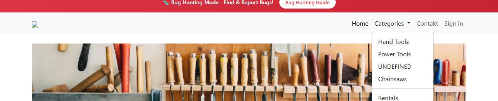
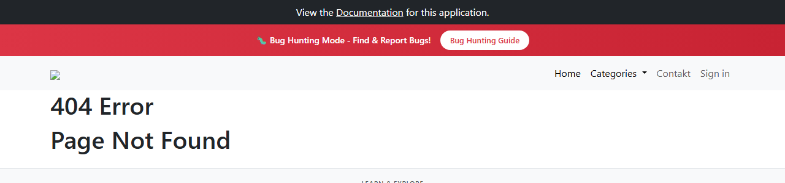

# BUG-019: Menu Categories má místo „Other“ a „Special Tools“ položky „UNDEFINED“ a „Chainsaws“ (404)

| | |
|---|---|
| **Stav** | Otevřená |
| **Nalezeno** | 5. 10. 2026 |
| **Oblast** | Navigace (hlavní menu) |
| **Závažnost** | Střední (návrh, zdůvodnění níže) |
| **Automatizovaný test** | [`tests/smoke/navigation.spec.ts`](../tests/smoke/navigation.spec.ts) („"Categories" lists the categories of the shop“, „every category in the menu opens its category page“), označené `test.fail()` |
| **Jira** | TQA-20 |

## Prostředí

- Aplikace: https://with-bugs.practicesoftwaretesting.com (titulek stránky „Practice Software Testing - Toolshop - v5.0 with bugs“)
- Prohlížeč: Chromium 153.0.8010.12 (Chrome for Testing z Playwright 1.63.0), ručně ověřeno i v Google Chrome
- OS: Windows 11

## Kroky k reprodukci

1. Otevři https://with-bugs.practicesoftwaretesting.com.
2. V hlavičce klikni na **Categories**.
3. Klikni na položku **Chainsaws**.

## Očekávaný výsledek

Menu nabízí kategorie obchodu jako referenční verze bez chyb (`header.component.html`, texty `en.json`):
Hand Tools, Power Tools, **Other**, **Special Tools**, Rentals. Každá položka otevře stránku své kategorie
(„Category: …“), Special Tools vede na `#/category/special-tools`.

## Skutečný výsledek

- Místo „Other“ je položka **„UNDEFINED“** (`#/category/undefined`), otevře prázdnou kategorii „Category: Undefined“.
- Místo „Special Tools“ je položka **„Chainsaws“** (`#/chainsaws`), otevře stránku **404 Error / Page Not Found**.
- Kategorie Other (na stránce `#/category/other` má 3 produkty) se z menu nedá otevřít.

## Důkaz

- Test: `tests/smoke/navigation.spec.ts`, výstup před označením `test.fail()`:
  ```
  - "Other",
  - "Special Tools",
  + "UNDEFINED",
  + "Chainsaws",

  Error: 404 page opened by "Chainsaws"
  Expected: 0
  Received: 1
  ```
- Screenshot: 
- Screenshot: 

## Dopad

- Zákazník se přes menu nedostane k produktům kategorií Other a Special Tools a narazí na chybovou stránku.
- „UNDEFINED“ v menu působí jako rozbitý obchod.

## Zdůvodnění závažnosti

Střední: navigace k části sortimentu nefunguje pro všechny zákazníky, ale produkty jsou dostupné
jinak (vyhledávání, filtry na domovské stránce), nákup to neblokuje.

## Návrh opravy

Vrátit položky menu podle referenční verze: „Other“ → `/category/other`, „Special Tools“ → `/category/special-tools`.

## Co nebylo ověřeno

- Lokalizované verze menu (jiné jazyky).
- Jestli kategorie Special Tools má v datech produkty (stránka `#/category/special-tools` je teď prázdná).
