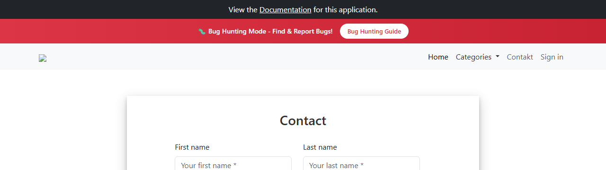

# BUG-020: Odkaz „Home“ v menu otevře kontaktní formulář místo domovské stránky

| | |
|---|---|
| **Stav** | Otevřená |
| **Nalezeno** | 5. 10. 2026 (poprvé zahlédnuto u TQA-1 jako postřeh) |
| **Oblast** | Navigace (hlavní menu) |
| **Závažnost** | Střední (návrh, zdůvodnění níže) |
| **Automatizovaný test** | [`tests/smoke/navigation.spec.ts`](../tests/smoke/navigation.spec.ts) („"Home" leads to the homepage“), označený `test.fail()` |
| **Jira** | TQA-21 (souvisí s TQA-23, logo) |

## Prostředí

- Aplikace: https://with-bugs.practicesoftwaretesting.com (titulek stránky „Practice Software Testing - Toolshop - v5.0 with bugs“)
- Prohlížeč: Chromium 153.0.8010.12 (Chrome for Testing z Playwright 1.63.0), ručně ověřeno i v Google Chrome
- OS: Windows 11

## Kroky k reprodukci

1. Otevři https://with-bugs.practicesoftwaretesting.com a přejdi na jinou stránku (např. **Contakt** nebo detail produktu).
2. V hlavičce klikni na **Home**.

## Očekávaný výsledek

Otevře se domovská stránka s výpisem produktů (`/#/`). Referenční verze má u odkazu `href="/"`.

## Skutečný výsledek

Otevře se kontaktní formulář `#/contact` (odkaz má `href="#/contact"`).

## Důkaz

- Test: `tests/smoke/navigation.spec.ts`, výstup před označením `test.fail()`:
  ```
  Expected pattern: /\/#\/$/
  Received string:  "https://with-bugs.practicesoftwaretesting.com/#/contact"
  ```
- Screenshot: 

## Dopad

- Zákazník se přes „Home“ nevrátí na výpis produktů. Jediná cesta zpět je logo, které se ale
  nenačítá (BUG-022), takže na něj zákazník nejspíš neklikne.

## Zdůvodnění závažnosti

Střední: základní navigace nefunguje pro všechny zákazníky, obejít se to dá (logo, tlačítko Zpět
v prohlížeči), nákup to neblokuje.

## Návrh opravy

Nastavit odkazu „Home“ cíl `/` jako v referenční verzi.

## Co nebylo ověřeno

- Mobilní zobrazení (rozbalovací menu).
