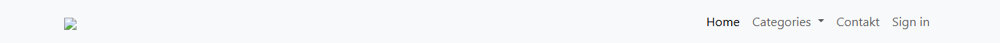

# BUG-021: Překlepy „Contakt“ v menu a „Serch“ na tlačítku hledání

| | |
|---|---|
| **Stav** | Otevřená |
| **Nalezeno** | 5. 10. 2026 |
| **Oblast** | Texty rozhraní (menu, vyhledávání) |
| **Závažnost** | Nízká (návrh, zdůvodnění níže) |
| **Automatizovaný test** | [`tests/smoke/navigation.spec.ts`](../tests/smoke/navigation.spec.ts) („the contact menu item says "Contact"“) a [`tests/smoke/search-button.spec.ts`](../tests/smoke/search-button.spec.ts), označené `test.fail()` |
| **Jira** | TQA-22 |

## Prostředí

- Aplikace: https://with-bugs.practicesoftwaretesting.com (titulek stránky „Practice Software Testing - Toolshop - v5.0 with bugs“)
- Prohlížeč: Chromium 153.0.8010.12 (Chrome for Testing z Playwright 1.63.0), ručně ověřeno i v Google Chrome
- OS: Windows 11

## Kroky k reprodukci

1. Otevři https://with-bugs.practicesoftwaretesting.com.
2. Podívej se na položku menu vpravo nahoře a na tlačítko pod vyhledávacím polem vlevo.

## Očekávaný výsledek

Texty jako v referenční verzi (`en.json`): položka menu **„Contact“**, tlačítko hledání **„Search“**.

## Skutečný výsledek

Položka menu je **„Contakt“** (`data-test="nav-contact"`), tlačítko hledání **„Serch“** (`data-test="search-submit"`).

## Důkaz

- Testy, výstup před označením `test.fail()`:
  ```
  Expected: "Contact"
  Received: "Contakt"

  Expected: "Search"
  Received: " Serch"
  ```
- Screenshot: „Contakt“ je vidět v hlavičce na 

## Dopad

- Neprofesionální dojem. Čtečka obrazovky přečte „Serch“ jako název tlačítka.
- Automatizované testy a nápověda, které hledají tlačítko podle názvu „Search“, ho nenajdou.

## Zdůvodnění závažnosti

Nízká: kosmetická vada, funkce menu i hledání fungují.

## Návrh opravy

Opravit texty na „Contact“ a „Search“.

## Co nebylo ověřeno

- Další jazykové verze.
