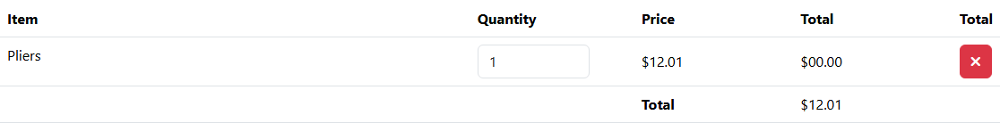

# BUG-023: Hlavička tabulky košíku má sloupec navíc a dvakrát „Total“

| | |
|---|---|
| **Stav** | Otevřená |
| **Nalezeno** | 5. 10. 2026 (poprvé zahlédnuto u TQA-5 jako postřeh) |
| **Oblast** | Košík |
| **Závažnost** | Nízká (návrh, zdůvodnění níže) |
| **Automatizovaný test** | [`tests/cart/cart-table-header.spec.ts`](../tests/cart/cart-table-header.spec.ts), označený `test.fail()` |
| **Jira** | TQA-24 (souvisí s TQA-5) |

## Prostředí

- Aplikace: https://with-bugs.practicesoftwaretesting.com (titulek stránky „Practice Software Testing - Toolshop - v5.0 with bugs“)
- Prohlížeč: Chromium 153.0.8010.12 (Chrome for Testing z Playwright 1.63.0), ručně ověřeno i v Google Chrome
- OS: Windows 11

## Kroky k reprodukci

1. Přidej do košíku produkt, který je skladem (např. Pliers, https://with-bugs.practicesoftwaretesting.com/#/product/2).
2. Otevři košík (ikona košíku v hlavičce).

## Očekávaný výsledek

Hlavička tabulky jako v referenční verzi: **Item, Quantity, Price, Total** a poslední sloupec
pro tlačítko odebrání bez nadpisu (5 sloupců).

## Skutečný výsledek

Hlavička má 6 buněk: Item, *(prázdná)*, Quantity, Price, Total, **Total**. Poslední sloupec
s tlačítkem odebrání má nadpis „Total“ a za „Item“ je prázdný nadpis navíc.

## Důkaz

- Test: `tests/cart/cart-table-header.spec.ts`, výstup před označením `test.fail()`:
  ```
  - Expected  - 1
  + Received  + 2
  +   "",
  -   "",
  +   "Total",
  ```
- Screenshot: 

## Dopad

- Zmatečná tabulka: dva sloupce „Total“, z nichž jeden obsahuje tlačítko.
- Čtečka obrazovky přečte u tlačítka odebrání nadpis sloupce „Total“.

## Zdůvodnění závažnosti

Nízká: vada zobrazení, funkce košíku tím ovlivněná není.

## Návrh opravy

Hlavičku tabulky upravit podle referenční verze (5 sloupců, poslední bez textu, případně s textem
skrytým jen vizuálně, např. „Actions“).

## Co nebylo ověřeno

- Mobilní zobrazení.
