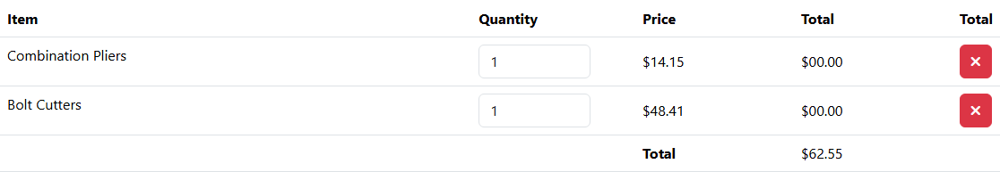

# BUG-027: Celková cena košíku se usekává místo zaokrouhlení (o cent méně)

| | |
|---|---|
| **Stav** | Otevřená |
| **Nalezeno** | 5. 10. 2026 |
| **Oblast** | Košík |
| **Závažnost** | Střední (návrh, zdůvodnění níže) |
| **Automatizovaný test** | [`tests/cart/cart-total-rounding.spec.ts`](../tests/cart/cart-total-rounding.spec.ts), označený `test.fail()` |
| **Jira** | TQA-29 (souvisí s TQA-5, AC2) |

## Prostředí

- Aplikace: https://with-bugs.practicesoftwaretesting.com (titulek stránky „Practice Software Testing - Toolshop - v5.0 with bugs“)
  a lokální kopie `sprint5-with-bugs` (http://localhost:4200)
- Prohlížeč: Chromium 153.0.8010.12 (Chrome for Testing z Playwright 1.63.0)
- OS: Windows 11

## Kroky k reprodukci

1. Přidej do košíku 1× Combination Pliers ($14.15, https://with-bugs.practicesoftwaretesting.com/#/product/1).
2. Přidej do košíku 1× Bolt Cutters ($48.41, `#/product/3`).
3. Otevři košík a podívej se na řádek **Total** pod tabulkou.

Produkty musí být skladem (na sdíleném demu se sklad mění). Ověřeno i s 2× Pliers ($12.01) + 1× Bolt Cutters.

## Očekávaný výsledek

$14.15 + $48.41 = **$62.56**. Referenční verze zobrazuje součet přes Angular pipe `number: '1.2-2'`,
který zaokrouhluje na centy.

## Skutečný výsledek

Košík ukáže **$62.55**, o cent méně. Stejně 2 × $12.01 + $48.41 ukáže $72.42 místo $72.43.

Příčina podle chování: součet v plovoucí čárce není přesný (14.15 + 48.41 = 62.559999…,
2 × 12.01 + 48.41 = 72.42999…) a aplikace zbytek useká místo zaokrouhlení. U součtů, které
v plovoucí čárce vyjdou přesně (např. 2 × $14.15 + $12.01 = $40.31), je částka správně.

## Důkaz

- Test: `tests/cart/cart-total-rounding.spec.ts`, výstup před označením `test.fail()`
  (veřejné demo i lokální kopie):
  ```
  Error: cart total rounded to cents
  Expected: "$62.56"
  Received: "$62.55"
  ```
  Test si sám vybere produkty skladem, u kterých se useknutí projeví (`totalShowsTruncation()`
  v `tests/helpers/cart.ts`). S dočasně chybným očekáváním (o cent méně) test projde.
- Ručně (skript na lokální kopii): 2 × Pliers + Bolt Cutters → $72.42.
- Screenshot: 

## Dopad

- Zákazník vidí v košíku jinou částku, než jaká odpovídá cenám položek. Nesoulad s fakturou
  (záleží na tom, jak počítá pokladna, neověřeno) by byl účetní problém.
- Chyba se projevuje jen u některých kombinací cen, takže se těžko hlásí a hledá.

## Zdůvodnění závažnosti

Střední: chybný údaj o ceně, který zasáhne část zákazníků (podle složení košíku). Rozdíl je cent,
nákup to neblokuje.

## Návrh opravy

Počítat v centech (celá čísla), nebo výsledek zaokrouhlit, ne useknout. Zobrazení jako referenční
verze (`number: '1.2-2'`).

## Co nebylo ověřeno

- Částka v pokladně (krok Payment) a na faktuře.
- Mezisoučty řádků (jsou vždy $00.00, BUG-014).
